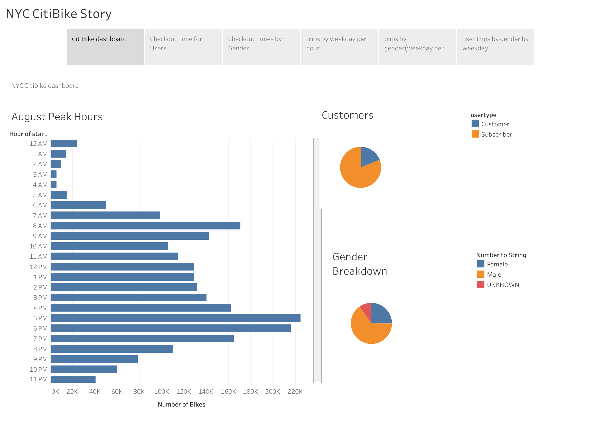

# Bike Sharing

## Overview 

Citi Bike is a bicycle sharing system in New York City. Travelers use bikes to explore historic landmarks, and there is the potential to start a similar bike-share business in Des Moines, Lowa. there may be an investor who might be interested in providing seed funding to explore a bike-share program in Des Moines. The first step is to figure out how the bike-share business works in New York City, and then create a proposal on how it may work in Des Moines. To solidify the business proposal, one of the key stakeholders would like to see the following in the bike trip analysis:

* The length of time that bikes are checked out for all riders and genders.
* The number of bike trips for all riders and genders for each hour of each day of the week.
* The number of bike trips for each type of user and gender for each day of the week.
    
## Results
    
### CitiBike Dashboard
* 1,900,356 were Subsriber Users and 443,865 were Customer Users.
* 1,530,272 were Males, 588,431 were Females and 225,521 were unknown users.
* Peak trip start time in August was 5 pm to 7 pm.
* Number for Bikes in use is lowest between 1 am to 5 am.

Dashboard:

